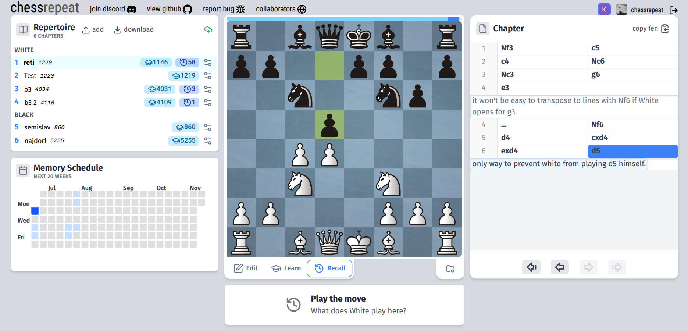

# chessrepeat

chessrepeat is a free, open source chess opening training platform.

It features real-time, collaborative opening training, move scheduling with spaced repetition, a playground mode
to train without logging in, and an intuitive, functional interface to edit your repertoire and surface 
training progress.

chessrepeat is built with a [React](https://react.dev/) + [TypeScript](https://www.typescriptlang.org/)
frontend and [Go](https://go.dev/) backend. It makes use of [WebSockets](https://developer.mozilla.org/en-US/docs/Web/API/WebSockets_API)
for real-time, collaborative training and [PostgreSQL](https://www.postgresql.org/) for the database. The
frontend is served via [Cloudflare](https://www.cloudflare.com/) and the backend runs in a
[Docker](https://www.docker.com/) container on an [OVHcloud](https://www.ovhcloud.com/) VPS served with
[Nginx](https://nginx.org/). Authentication is handled with [Google OAuth](https://developers.google.com/identity/protocols/oauth2).
The frontend leverages [chessground](https://github.com/lichess-org/chessground) for the UI and
[chessops](https://github.com/niklasf/chessops) for chess logic.

<!-- placeholder: full-app screenshot showing the board mid-drill with the move tree on the side -->

---

### Spaced Repetition in chessrepeat

chessrepeat schedules your reviews with [**spaced repetition**](https://en.wikipedia.org/wiki/Spaced_repetition),
which rewards correct guesses with reviews that are scheduled at increasingly longer intervals (in 1 day, 3 days, a week, etc...). The goal here is to minimize the amount of time you spend reviewing moves that you already know. 

More specifically, chessrepeat uses the [**FSRS**](https://github.com/open-spaced-repetition/ts-fsrs) algorithm to
schedule moves. We store a *stability* and *difficulty* number in each move and use them to approximate when a move
should be next trained. 

Read more about FSRS [here](https://github.com/open-spaced-repetition/fsrs4anki/wiki)
